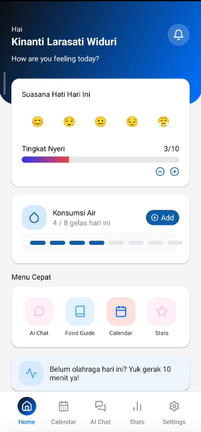
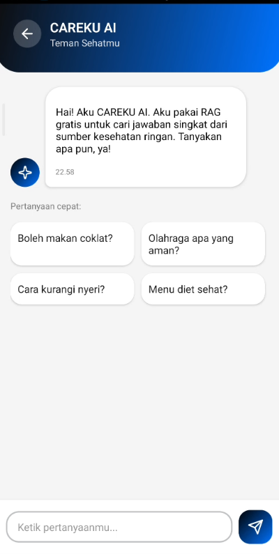
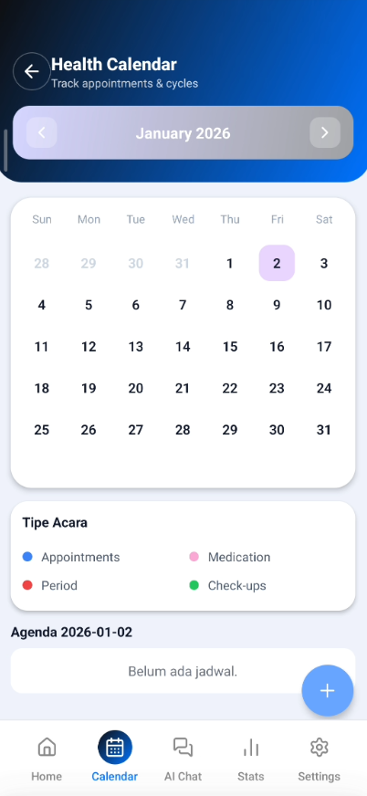

# CAREKU 🩺

🚀 **Aplikasi pendamping kesehatan personal**

**CAREKU** membantu kamu mencatat kesehatan harian, kalender janji temu, statistik hidrasi/nyeri, chat, diary, dan profil kesehatan dengan tampilan modern. Data tersimpan ke Firestore sehingga bisa diakses lintas perangkat. 💙

## 📌 Fitur Utama

✅ **Login & Register (Email/Google)** dengan biometrik optional.\
✅ **Profil & Health Setup** (usia, tinggi, berat, kondisi kesehatan).\
✅ **Home Tracking** mood, nyeri, dan konsumsi air tersinkron ke Firestore.\
✅ **Stats & Insights** grafik nyeri/hidrasi + insight otomatis.\
✅ **Health Calendar** CRUD event (appointment, medication, period, check-up) tersimpan di Firestore.\
✅ **AI Chat & Diary** dengan context kesehatan pribadi.\
✅ **RAG Client** via Groq untuk jawaban kontekstual (konfigurasi API key via env).

🔜 **Coming Soon**
✨ **Tips RAG personalisasi lanjutan** dan integrasi notifikasi.

## 📷 Tampilan (contoh)

- Home tracking, Stats & Insights, Health Calendar dengan gradient UI.
- Contoh mock:

  

💡 **CAREKU - Teman harian untuk kesehatanmu.**
